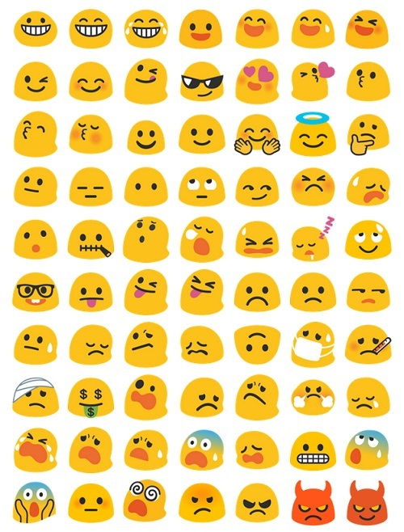

# Blob Emojis Menu Firefox WebExtension

**This add-on adds an icon on the Firefox toolbar, offering a menu with emojis to insert in your messages. Emojis are displayed with their Google "blobs" representation from Android 6.0.1.**

## What it does

This extension includes:

* the emoji pop-up in the "emoji-menu" folder : the html page displayed in the pop-up, and 2 .js scripts to copy an emoji on the clipboard when clicked
* Noto emojis in an SVGinOT font (support colour and compatible with Firefox) from https://github.com/DeeDeeG/noto-color-emoji-font/releases/tag/v1.1.5 : it contains blob emojis from Android 6.0.1 completed with newer versions for missing emojis (7.0, 8.0, 9.0) 
